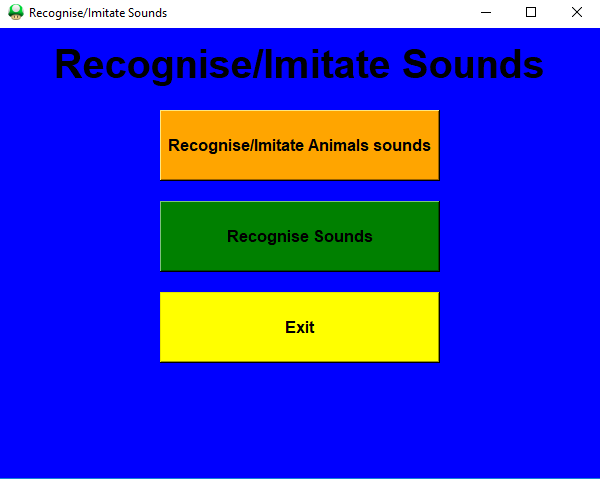
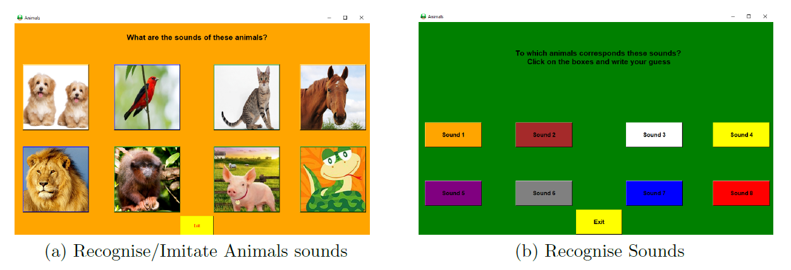
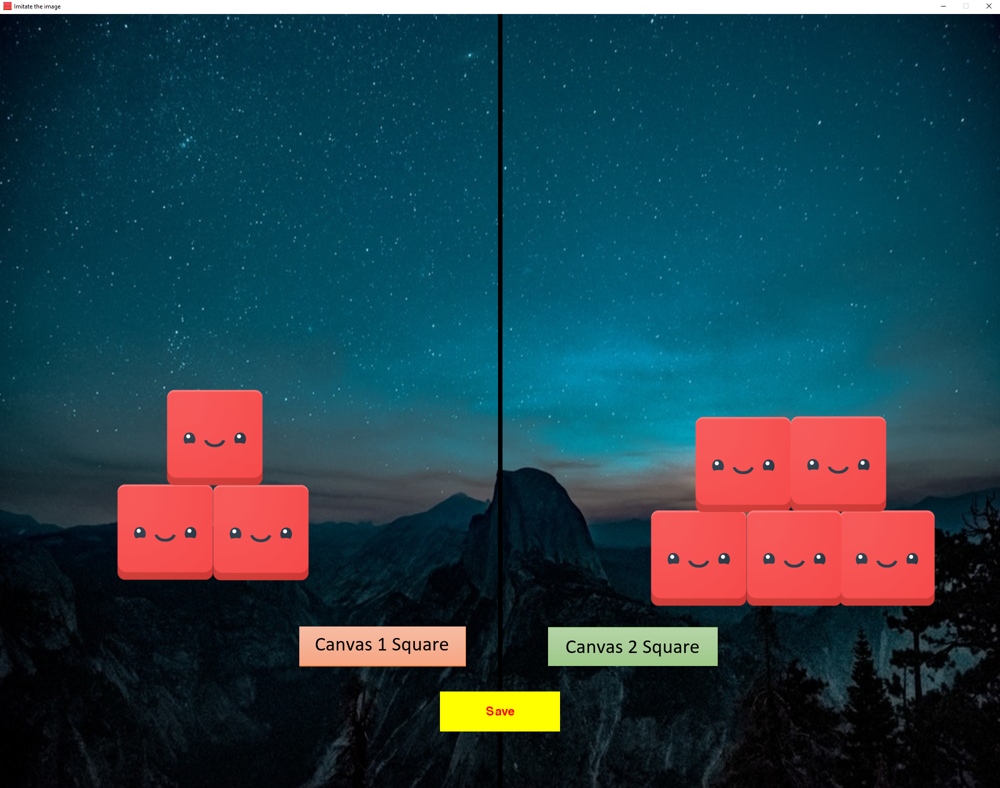
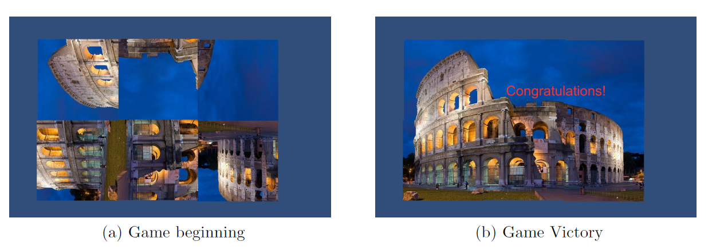
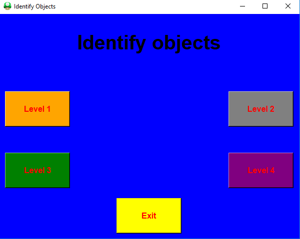
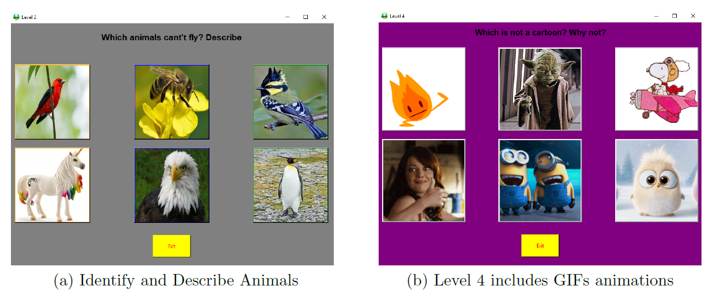
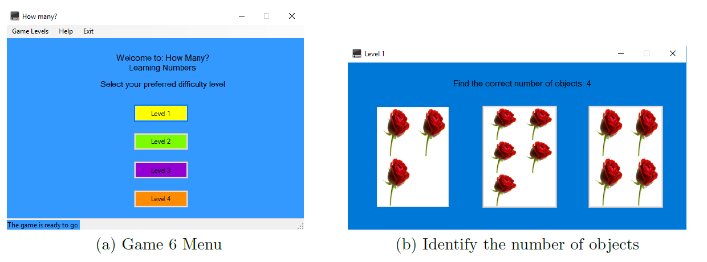
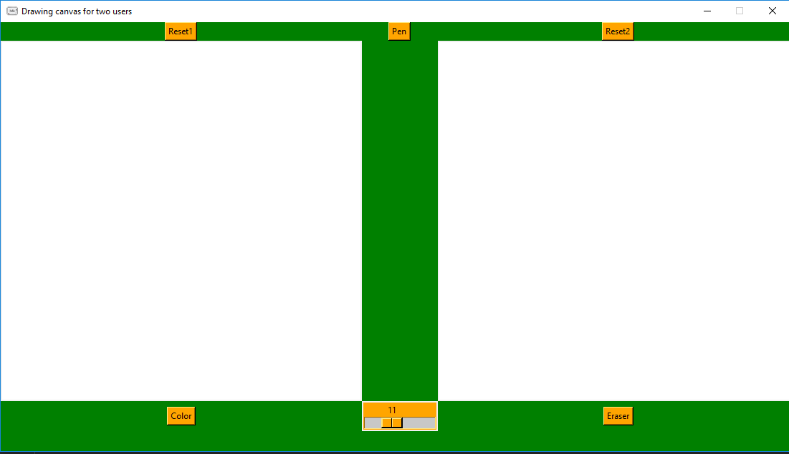

Gaming Platform
===============

Hardware implementation
-----------------------

In regard to a hardware solution, to help children's with disabilities,
I decided to make a projector using a DLPDLCR2000EVM Evaluation Board
and a Raspberry-Pi 3B (running the Raspbian operating system).
Succesively, I managed to then make the area projected touchscreen using
a Wiimote (Wii Remote controller [24]) and an Infrared (IR) pen I
built myself. The Wiimote is connected via Bluetooth (to the
Raspberry-Pi) and is used as an infrared receiver to detect the
activities of the infrared pen on the projected surface. Finally, I
programmed a range of games that can be loaded on the Raspberry-Pi for
children to play.

In order to wire and configure the connections between the Evaluation
Board and the Raspberry-Pi, I followed an online guide by Frederick
Vandenbosch [25] (Appendix A). I then set up the Raspberry Pi
Bluetooth (to enable the Wiimote connection) by connecting the Bluetooth
adapter and then installing the Bluez and Wiimote integration packages
through Linux terminal. Lastly, I installed a free python-whiteboard
software by Martin Rudel [26] to be used in order to calibrate
the surface of the projected area.

It is also possible to implement this solution on Windows using a
standard projector and the free whiteboard calibration software
Smoothboard Air with Duo [27].

*Figure 3.1: Infrared Pen, DLPDLCR2000EVM Evaluation Board and Raspberry Pi*

Figure 3.2 shows the two different playing modes which can be used. In
the first one, the projected area can be used as a whiteboard, while in
the second one the user can choose to play far from the surface using
the infrared pen as a pointer. Choosing the playing mode to use is
important to pick the right calibration position of the Wiimote.

*Figure 3.2: Touchscreen projector playing modes*

This hardware interface was mainly designed to help children affected by
Developmental Coordination Disorders. This type of motor disorder causes
coordination problems (eg. wrong movement timing/balance) due to
incorrect communication between the brain and the body.

First Game Development
----------------------

I decided firstly to make a game designed for children with cognitive
disabilities to test both their rate of reception and their ability to
work with others. In order to create this game I made use of references
such as \"Python game development\" [28] and \"Beginning Game
Development with Python and pygame\" [29]. I decided to program this
game using Python as programming language and pygame as my main working
library.

Figure 3.3(a) shows the menu interface I designed for the game. I
decided to name the game \"Avalanche Escape\", since it consists of
moving characters around the graphical user interface (GUI) to avoid
falling snowflakes. The GUI can be considered as a Cartesian coordinate
system. During the game, the snowflakes fall from the top of the window,
always changing their Y axis starting position. The snowflakes velocity
slowly increases every-time the character successfully manages to avoid
them (Figure 3.3(b)). This way the game will seem relatively easy to
play at the beginning but as the user practises and gets better at
playing it, the game difficulty will also increase. It is possible to
read the game instructions using the game instruction button present on
the menu.

*Figure 3.3: Avalanche escape*

In the menu the user can choose to play in either single or multi player
mode. In single player mode, the male character is moved by either using
the mouse or keyboard arrows. In multi player mode, the female character
is instead moved by using the mouse and the male one by using the
keyboard. If one of the characters is hit by a snowflake, a menu will
prompt warning of the collision and ask if the user wants to play again
or go back to the main menu. If the user manages to avoid the
predetermined number of snowflakes asked by the task, a menu will appear
on the screen congratulating the user for winning. Each of these actions
are accompanied by sounds which are correspondent to whether the user
wins or loses the game in order to increase user engagement. Throughout
the whole playing time, there is music playing in the background.

The user can pause the game at any time by pressing the keyboard escape
button and switch between full-screen display mode (pressing F) and
standard screen mode (pressing N). A computer play mode is also present
which can be used to demonstrate to the user how to play. In order to
implement the computer play mode I used a simple algorithm. Using
Machine Learning instead of traditional coding could potentially lead to
better gaming performance and score.

Finally, I made an executable version of this game which can be easily
installed on any type of Windows platform using the cx\_Freeze python
library.

Imitation Games
---------------

Imitation is the ability to mimic other people behaviours. Children
usually start imitating others from around the age of two and to mimic
different types of behaviour at different age stages. The ability to
imitate is not something inherently transmitted but is instead the
result of our human social life organisation.

Studies demonstrate that children with autism usually suffer delays in
their Imitation and Joint Attention abilities. Imitation skills can play
a fundamental role in a child's behavioural development. During this
project, I decided to design different games to try to stimulate and
enhance these kind of abilities.

### Second Game Development

This game is divided into two different modes (Figure 3.4). When
selecting the first mode, the child is asked to recognise the animals in
the pictures (Figure 3.5 (a)). Clicking on each of the different buttons
an audio will play the sound of the corresponding animal and a message
box will appear. The child will then be asked to type in a text-box the
appropriate animal name. If the child types the right animal name (it
doesn't matter if the name is written in all lowercase, all uppercase or
a in mixture of them) a congratulations message box would appear. If
instead the the child types the wrong answer, it would be encouraged to
try again.

*Figure 3.4: Game 2 Menu*

When selecting the second mode (Figure 3.5 (b)), the child is instead
asked to recognise and then write the animals names, this time by just
hearing without corresponding images (therefore increasing the game
difficulty). When playing either of the game modes the child will be
encouraged by the parent/therapist to try to talk about the identified
animals and to imitate their sound.

*Figure 3.5: Game Mode Options*

This game therefore aims to improve a child's ability to recognise and
imitate animal sounds in the first mode and in the second one to guess
(encouraging them to first take a risk and then learn from his/her
mistakes) and imitate animals sounds. Different levels of difficulty can
eventually be designed as further development of this game. The modes
designed so far are aimed to not be too difficult, in order to try to
not discourage a child from playing (if the game would have been too
difficult from the start, a child might lose interest).

This game was designed using Python and libraries such as Tkinter,
pygame and PIL.

### Third Game Development

The aim of this game is to encourage children to imitate the
therapist/parent's actions and to build objects/shapes (Figure 3.6). The
game GUI consists of two canvases which can interchangeably be used by
either the child or therapist/parent. Selecting the correspondent
buttons, the users would be able to make appear on the screen up to six
blocks which they can drop and drag around the screen to create objects
or shapes. If an user tries to place a block either outside the game
window or in the canvas of the other player, he/she will be stopped by a
warning prompt asking him to try again. While playing this game, the
parent/therapist should build one or more object(s) using the given
blocks on one canvas and the child should then try to imitate the same
object(s) on his canvas either while the parent/therapist is making it
or after.

*Figure 3.6: Game 3*

-4ex Once the child has come up with his solution to this problem, it is
then possible to store the result by clicking the \"Save\" button on the
GUI. A screen-shot will then be generated and stored as a record of the
child's performance. Keeping a record of all the different attempts the
child makes while trying to build different types of objects, is then
possible to see whether the child has improved over time and understand
if the child has a problem imitating certain specific shapes or
patterns.

I also decided to implement an EXE version of this game to make
implementation easier. This game was designed using Python and libraries
such as pyoutogui, pygame and time.

### Fourth Game Development

This game was designed to help children develop their recognition and
matching skills solving puzzles (Figure 3.7).

*Figure 3.7: Game 4 Menu*

I decided to design this game using Unity for Graphic Development and
C\# as programming language for coding the graphics behaviour. I decided
to opt for this solution because it enabled me to make available this
game not just for desktop platforms (like in all the other games made so
far), but also on Android devices (eg. mobile phones and tablets). This
was made possible by creating both an EXE and APK format of the game.
Both versions have been successfully tested on both platforms.

*Figure 3.8: Game Mode*

Clicking (or tapping using a touchscreen Android device) on each of the
images that composes the puzzle makes them rotate by 90clockwise (Figure
3.8 (a)). Once the child has selected the right orientation for each of
the puzzle images, a congratulations text message appears on the screen
and the user is redirected to the main menu where they can decide if to
play again or end the game (Figure 3.8 (b)).

Joint Attention Games
---------------------

Joint attention (JA) is the ability of two individuals to share their
interest on the same event, person or object. This implies an underlying
understanding between the two people in question. This can be achieved
through any form of verbal or non-verbal indication such as pointing or
eye-gazing. In JA, a child follows the lead of the parent/therapist and
tries to copy or mimic them. JA allows children to share enjoyment and
learn from others.

Children usually start showing the first forms of JA around the age of 9
months old. Children affected by autism symptoms might instead show JA
abilities later on or, in some cases, might never fully develop them. To
external viewers, this might look like a lack of engagement in
collaborating and interacting with other people.

There are two main forms of JA:

-   Child initiating JA

-   Child responding to call of JA from another person

### Fifth Game Development

I decided to structure this game with four different levels of
difficulty (Figure 3.9). This game consists of identifying the right
objects between the given options (there can be either one or more right
answers) and recording the child's justification for their decision.
It's main application is to improve child's receptive communication.

*Figure 3.9: Game 5 Menu*

If the child selects the right answer, a congratulations prompt will
appear. The prompt will inform the child he/she made the right choice
and will then inform them that closing it will start the recording. The
recording will continue until the child stops speaking. For each time
the child selects the right answer, the recording will be stored and
could then be used for later analysis by the therapist. The recording
will play a vital role in evaluating the understanding of the child and
track any signs of improvement. If the child selects instead a wrong
answer, a prompt will encourage him/her to try again (Figure 3.10 (a)).

*Figure 3.10: Game Mode Options*

For the fourth difficulty level of this game, I decided to make the
buttons interactive using instead of plain images, animated GIFs. Doing
so I aimed to make the game more stimulating and interactive for the
child (Figure 3.10 (b)).

This game was designed using Python and libraries such as Tkinter, PIL,
itertools, pyaudio and wave.

### Sixth Game Development

This game aims to help children improve their receptive communication,
in particular their understanding of quantities and numbers. I decided
to design this game using Microsoft Visual Studio and C\#, which
facilitated the creation of the final EXE file.

The menu interface (Figure 3.11 (a)) offers apart from the main buttons
also a top drop down menu which can give additional help for the child
to learn about the game. At the bottom of the GUI is also present a
status bar, offering additional information to the user about the
meaning of the different menu options (once clicked on them) and to keep
the user updated about the status of the game.

As shown in Figure 3.11 (b), during each game level are tested the
child's abilities to identify the button showing the asked right number
of objects displayed in the pictures.

*Figure 3.11: Game Six Options*

### Seventh Game Development

The seventh game I decided to design was a drawing canvas for two users
(Figure 3.12). I decided to program this game using Python and the
Tkinter graphics library. The two canvases consist of two independent
drawing surfaces. This way, it is either possible for the user to make
free drawings when playing on their own or to let the therapist/parent
draw something on one of the two canvas and then let the child imitate
their drawing on the other canvas. It is additionally possible, when
playing with the therapist/parent, to let the fist write or pronounce a
word and then let the child draw the corresponding image. This type of
game aims to help children learn through imitation and respond to
external stimulus.

*Figure 3.12: Drawing canvas for two users*

As can be seen from Figure 3.12, the GUI gives the users the choice to:
select their preferred font size (bottom centre slider), favourite
colour (left-bottom button), switch between pen and eraser mode (top
centre button, right bottom button) and to clear the canvases (top left
button for left canvas and top right button for right canvas).

EEG Cap
-------

Having designed a suite of games and tested they functioned correctly
using them with the hardware implementation, I started working to
connect, synchronise, and store the data from the EEG Cap. In my case, I
have been working with the Enobio 20 (produced by Neuroelectronics
[30]), a wearable, wireless sensor system used for
recording electroencephalogram (EEG) signals.

In order to connect and control the Enobio 20 using my laptop, I first
had to install the Neuroelectrics Instrument Controller (NIC) free
software offered by Neuroelectronics and then connect my laptop to the
Enobio 20 via bluetooth using the NIC. Once I made sure everything was
set up between my laptop and the Enobio 20, I started working on trying
to control the Enobio 20 calling a MATLAB script instead of having to
use the NIC. To do so, I made use of the MatNIC MATLAB toolbox produced
by Neuroelectronics [31].

Making a MATLAB script calling some of the many available MatNIC
functions, I managed to automate the process of: opening the NIC
software, connecting the Enobio 20 via bluetooth, starting the EEG
readings for a chosen predetermined amount of time and output the final
reading results in a comma-separated values (CSV) file format.

When calling the MATLAB script, it is still necessary to press \"Enter\"
to allow the NIC software to be controlled remotely. This has been
included by Neuroelectrics for security reasons, in order to avoid
giving unauthorised access to the EEG Readings.

Using the MatNICEEGRecord function (keeping TCP connection enabled), the
CSV file is composed by as many columns as the channels of the device
(in this case 20) and two more columns, one for the markers (if no
markers have been sent, this column will be composed just by zeroes) and
one for the timestamp. If instead the MatNICEEGRecordLSL function is
used (through Lab Streaming Layer communication), the CSV file is
composed by as many columns as the channels of the device (in this case
20). The units of the measurements for each channel are in nano-Volts
(nV).

Finally, I managed to synchronise the seventh game I developed with the
EEG readings calling the MATLAB script I made, using Python. I therefore
modified the code for the drawing canvas for two users by adding the
matlab.engine library to call the MATLAB script file and using the
threading library to make the canvas game and the EEG reading run
simultaneously (without dividing the code into threads they would have
run sequentially, compromising synchronisation).

The main functions described above are available in Appendix B, Listings
1 and 2.
