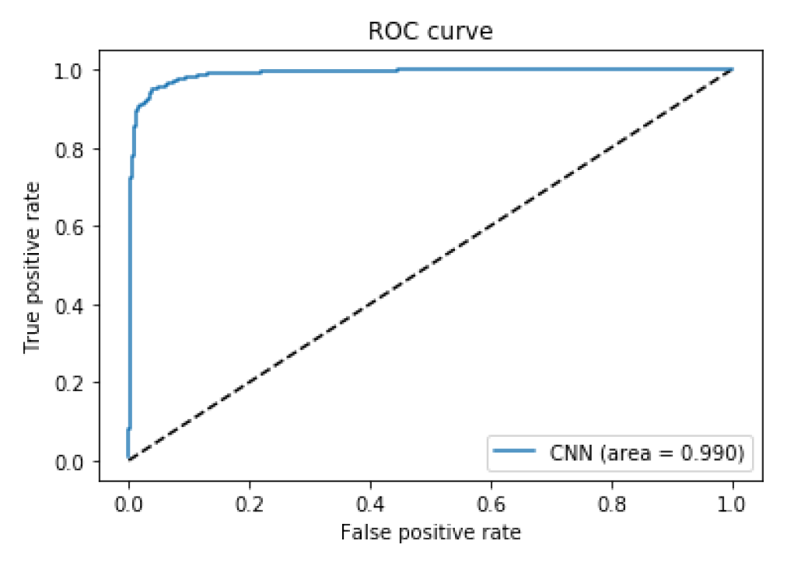

Artificial Intelligence
=======================

As part of this chapter, the analysis of an EEG data-set to identify if
a child is affected or not by autism will be outlined. Both Machine
Learning (ML) and Deep Learning (DL) approaches used to tackle this task
will be examined. Additionally, a Computer Vision based approach to ASD
screening will be proposed.

Faces Responses in Children with ASD
------------------------------------

Children affected by ASD usually show difficulties in comprehending
other people's emotions. A study carried out in 2012 by Fabio Apicella,
Federico Sicca et al. ("Fusiform Gyrus responses to neutral and
emotional faces in children with Autism Spectrum Disorders: a High
Density ERP study" [32]) aimed to register the EEG response of a
group of children (some of which were affected by ASD and some who
weren't) to examine their reaction to different forms of stimuli (eg.
Happy/Sad/Neutral faces, and images of Cartoons and Trees).

![Stimuli used. Image reproduced from:
[@pisa]](images/stimolus.PNG)*Figure 4.1: Stimuli used. Image reproduced from: [32]*

Informed consent was given by all the children parent's before
undertaking any measurement. Upon Ethics Approval, I made
use of the EEG data (in the time-domain) collected during this study to
determine whether it was possible to accurately classify which children
were affected or not by ASD using Machine Learning. The data-set
consisted of the EEG data (for all the five stimuli repeated multiple
times) collected from twelve children affected by ASD and twelve who
weren't.

The data originally provided was in a MATLAB format. After a first
exploratory analysis, I then decided to convert each file in a CSV
format and then merged them so to perform my analysis using Python. I
ended up making six CSV files, one for each of the five stimuli and one
containing all the five stimuli together.

For each child, the MATLAB data was stored using a three dimensional
array. The first dimension represented the number of EEG channels (128),
the second dimension represented the number of time-steps (250) and the
third dimension the number of repetitions (between 20 and 80, depending
on the child). Once the data had been converted in the CSV format, I
structured it in a table. This table has 129 columns (one for each
channel and one to label the data as either typical or ASD), every 250
rows was stored one stimulus repetition with their correspondent label.

The data-set containing all the five stimulus, had been demonstrated to
be balanced, containing 49.03% of the data of children without ASD and
50.97% of the data of ASD children.

All the plots obtained during a first exploration of the data using
MATLAB are present in Appendix C. The ML and Deep Leaning results
obtained using the individual data-sets for each stimulus are instead
present in Appendix D.

### ML Classification

Once I constructed the full data-set containing all the five stimuli, I
then decided to try to perform a classification task using Machine
Learning. In order to do so, I made use of many Python libraries such
as: pandas, numpy, matplotlib.pyplot, sklearn and itertools.

The pre-processing part consisted of, firstly loading the data,
standardising it and then dividing it in training (70%) and test sets
(30%) for both the inputs (X) and outputs values (Y). The total number
of rows in the data-set was equal to 1906500 (934750 rows about typical
children EEG data and 971750 about ASD data). Because of the 70% against
30% train/test split ratio, 5338 predictions were made during the
training set (1334550/250 time-steps) and 2288 predictions during the
test set (571950/250 time-steps).

I finally decided to train and then test the binary classification
results using different algorithms such as: Logistic Regression, Support
Vector Machines (SVM), Decision Trees, Linear Discriminant analysis
(LDA) and Gaussian Naive Bayes Classifier (GNB). The classification
results are show in Table 4.1. At the output, a zero represent a typical
child and a one represents a child affected by ASD. The models used
attempted to identify if a child is affected or not by ASD using just a
single stimulus repetition
(128 channels × 250 timesteps × 1 repetition).

![Table 4.1: ML Classication Accuracy
[@pisa]](images/mlres.PNG)*Table 4.1: ML Classification Accuracy*

The Decision Tree achieved the most accurate result. Decision Tree is a
type of supervised learning algorithm which can be used for either
classification or regression tasks. What distinguishes Decision Tree
from other ML algorithms, is their ability to display their decision
making process using an upside-down tree like representation. In the
tree, each node represents a feature in the data-set, each branch a
decision rule and each leaf a decision outcome. In this implementation,
I decided to use the CART (Classification and Regression Trees)
algorithm implementation which makes use of the Gini Index as metric
(code available in Appendix B, Listing 3). Appendix E shows the
beginning of the decision making process made by the Decision Tree to
decide its classification criteria for this data-set.

Performing PCA (to reduce data dimensionality to two dimensions) on the
data lead to a sharp decrease in accuracy (51% accuracy at maximum using
a Decision Tree).

*Figure 4.2: PCA Decision Tree Classification Results (0=Typical, 1=ASD)*

The trained Decision Tree model has then been successfully saved and
stored (using the pickle library) to be ready for later use.

### Deep Learning Classification

To increase accuracy of results, I then decided to implement Neural
Networks (LSTM and CNN). I preferred to use these typologies of ANN
instead of a Feed-Forward one because of their ability to work with
sequential data. Most of the libraries used for ML Classification have
been reused for the Deep Learning implementation, also the train/test
ratio split has remained unaltered.

#### Long Short-Term Memory

In order to code this Neutral Network I decided to use the Google Open
Source Deep Learning library Tensor-Flow. After careful literature
background research, I decided to design the ANN architecture following
the "Human Activity Recognition using LSTMs on Android" Medium guide
[32]. For this implementation, I decided to change the
pre-processing stage and some of the architecture parameters in order to
best suit the data-set shape and characteristics (pre-processing code
available in Appendix B, Listing 4) .

*Table 4.2: LSTM Parameters*

Letting training this model for 50 epochs, using the parameters shown in
Table 4.2, lead to an impressive overall validation accuracy of 96.935 %
(The full training accuracy and loss evolution is present in Appendix
F). From Figure 4.3, it can be witnessed that both the training/test
loss and the training/test accuracy curves closely match. This confirms
the correct L2 regularisation (Ridge Regression) parameter was chosen.

L2 regularisation aims to eliminate over-fitting by minimising the model
complexity and loss. By using L2 regularisation, the model complexity is
evaluated by summing and squaring all the model feature weights. One of
the easier ways to identify overfitting in a model is by comparing the
training and test sets loss functions. If the two are really similar,
our model is successfully able to generalise to new data without losing
accuracy. If instead the two functions are very dissimilar, our model
might be able to perform well in the training phase but not during the
test phase. Indicating that during the training our model overfitted the
data learning also irrelevant information (such as noise) and was not
able to correctly classify new data (Bias-Variance Trade-off).

*Figure 4.3: LSTM training/test loss and accuracy against epochs*

On the other side, the LSTM required a considerable amount of memory and
time to train which could potentially become a problem if working with a
greater amount of data. To avoid having to retrain the model, it was
successfully saved and stored using the pickle library. Different
metrics have been performed to test the overall efficiency of the model
such as calculating the Confusion Matrix and AUC-ROC curve.

*Table 4.3: LSTM Confusion Matrix*

From the Confusion Matrix it is then possible to calculate the model
Sensitivity and Specificity.

*Figure 4.4: LSTM ROC plot*

All these metrics confirmed that the model did not overfit the data as
seen in Figure 4.3. In fact:

-   The ROC curve score was close to 1 (0.997).

-   The number of False Positives and False Negatives in the Confusion
    Matrix were close to each-other (therefore the model gave the same
    weight to both classes).

-   Both the Sensitivity and Specificity results were higher than 97%.

#### Convolutional Neural Network

I finally decided to design a CNN in the hope to construct a faster
model than the LSTM that would still able to achieve high accuracy. In
order to construct the network architecture, I decided to use the Keras
Python library.

The model consisted of:

1.  One 2D Convolutional Layer of 64 filters, a kernel size of
    5 × 5, a ReLU (Rectified Linear Unit, Equation 4.3) function
    and same padding. 
    
    

2. Another 2D Convolutional Layer having 32 filters, a kernel size of
   5 × 5, a ReLU (rectified linear unit) function, same padding
   and an L2 regularisation coefficient of 0.01 (to prevent
   overfitting).

3. A 2D MaxPooling layer of 2 × 2 size.

4. A Dropout layer of 0.2 intensity (in order to avoid over-fitting the
   data).

5. A layer to first flatten the data from three dimensions to just one,
   and then another one to condense the input to give to the classifier
   128 features (always using the ReLU function and L2 regularisation).

6. A second Dropout layer of 0.5 intensity.

7. Finally, a Dense layer (of two neurons) to produce the
   classification result, using a Softmax activation function. The
   Softmax function (Equation 4.4) will take in this case the two
   inputs from the neurons and convert them in two probabilities that
   sums up to one. The greater probability was rounded up/down to
   either one or zero to represent the CNN output choice (Typical(0),
   ASD(1)). 

   

In order to optimise the training, the Adam (Adaptive Moment Estimation)
gradient descent algorithm was used, and the cross-entropy function was
used to compute the model loss. The cross-entropy function
(Hy'(y)), in a binary classification case can be calculated by
using Equation 4.5. 

This model achieved an overall validation
accuracy of 94.58% in just thirty epochs of training.

*Figure 4.5: CNN Model Training*

Both the LSTM and the CNN are able to classify if a child is affected or
not by ASD just by observing one stimulus repetition (128 channels, 250
time-steps, 1 repetition, 1 stimulus). The overall accuracy of the CNN
was 2% lower compared to the LSTM one, but the training time and amount
of power needed to run this model was much lower. Also this model was
successfully saved and stored (in a json and h5 file type) for later use
(Code available in Appendix B, Listing 5).

Also in this case different metrics have been performed to test the
overall efficiency of the model such as calculating the Confusion Matrix
and AUC-ROC Curve.

*Table 4.4: CNN Confusion Matrix*

From the Confusion Matrix it is then possible to calculate the model
Sensitivity and Specificity.

*Figure 4.6: CNN ROC Curve*

For the same reasons examined in the LSTM analysis, the CNN model does
not seem to be affected by over-fitting. However, the CNN performed
overall worse than the LSTM. That's because of the bigger difference
between the registered False Positives and False Negatives in the
Confusion Matrix, which caused the Specificity score to be negatively
affected.

Autism Study Using Behaviour Imaging
------------------------------------

Computer Vision is an AI area which has seen exponential improvements
during the last few years, especially because of the introduction of
Convolutional Neural Networks. According to some research papers such as
"Computer vision and behavioural phenotyping: an autism case study"
[34] and "Behaviour Imaging: Using Computer Vision to Study
Autism" [35], this subject can potentially have an huge
impact in ASD detection in children. This can be done by:

1.  Making Computer Vision games to test child's ability to recognise
    and imitate facial expressions or feelings.

2.  Recording the child-therapist sessions to then examine the recording
    to find out if the child has shown: some reaction delay to the
    applied stimulus, any repetitive behaviour or any abnormal
    walking/speaking behaviour.

### Game Application

As part of this project I decided to design a game to test a child's
ability to make a series of facial expressions. In order to realise this
game, I partially followed the "Real Time Facial Expression Recognition
on Streaming Data" post by Sefik Ilkin Serengil [36] to make
use of his pre-trained model for facial expression recognition. I
successively coded the game using Python libraries such as: cv2, keras,
tkinter and PIL.

The game interface is formed by two windows. In the first one, the user
is told if their face is correctly detected and what facial expression
they should perform (Figure 4.7 (a)). In the second one, the camera
recording is displayed and if a face is detected an empty rectangle will
cover the face area displaying on the top left corner the detected
expression (Figure 4.7 (b)). Once the user has made the asked
expression, a pop-up window will appear to congratulate the user and the
first window will update to ask to make a different face expression. The
list of available face expressions consist of: angry, fear, happy, sad,
surprise and neutral faces.

*Figure 4.7: Computer Vision Game*

