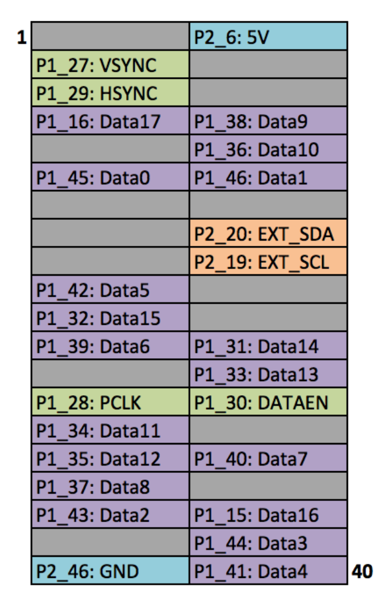
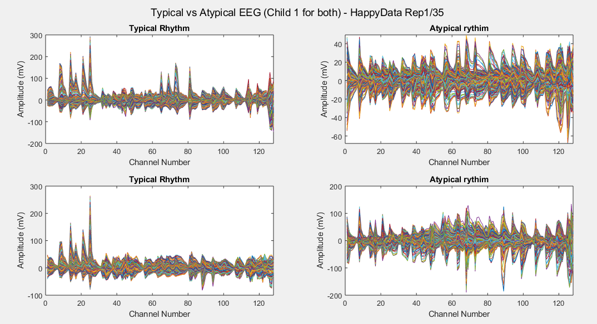
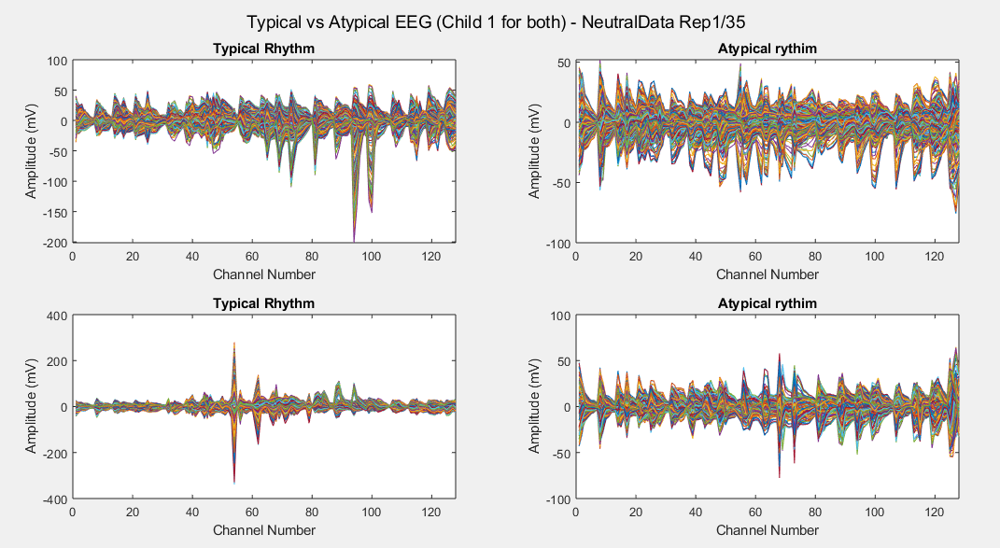
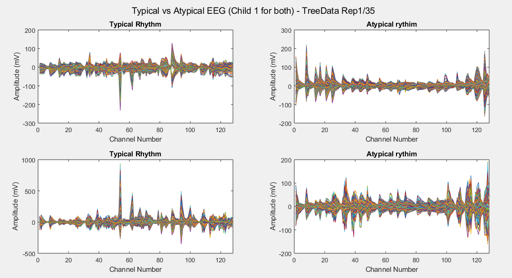
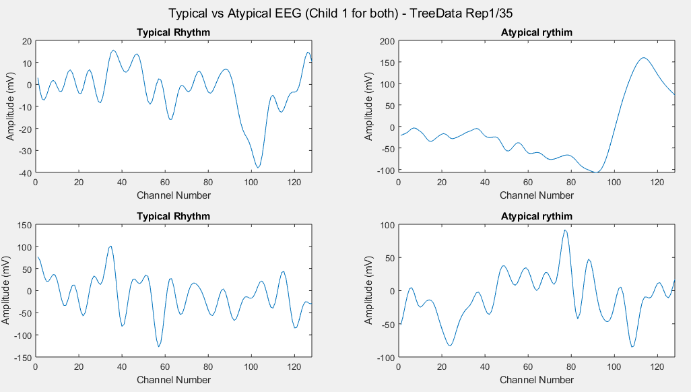
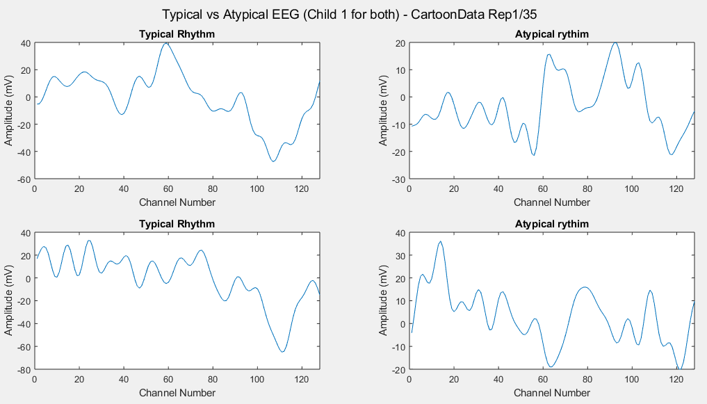
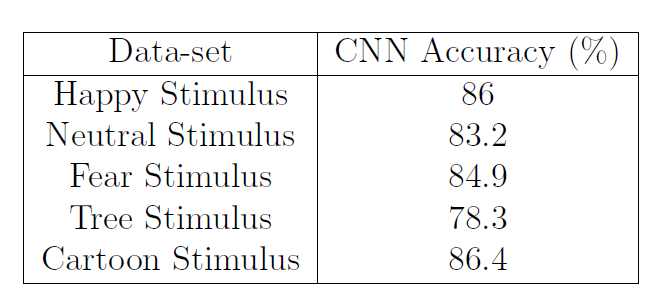

# Appendices

## Appendix A: Evaluation Board wiring and stand

*Figure A.1: Evaluation Board*



*Figure A.2: Raspberry Pi's GPIO*

Images reproduced from Frederick Vandenbosch DLP, LightCrafter Display
2000 EVM on Raspberry Pi [25].

*Figure A.3: Projector stand design made using Fusion 360*

## Appendix B: Listings

In Listing 1 has been chosen a period of 30 seconds and 20 channels.

```matlab
[ret, intletEEG] = MatNICEEGConnectLSL('NIC')
[ret, eeg_set, timestamp_set] = MatNICEEGRecordLSL(30, 20,intletEEG)
csvwrite('output-gameplay.csv',eeg_set)
```

*Listing 1: MATLAB code setupscript3.m*

```python
import matlab.engine
from threading import Thread
#  EEG readings pre-game and set-up
eng = matlab.engine.start_matlab()
eng.addpath(r'path_to_file', nargout=0)
tf = eng.setupscript(nargout=0)
print(tf)
# Defining threading function to get and store eeg data while playing
def eeg_func():
    # EEG readings during-game
    eng = matlab.engine.start_matlab()
    eng.addpath(r'path_to_file', nargout=0)
    tf3 = eng.setupscript3(nargout=0)
    print(tf3)
Thread(target = eeg_func).start() 
```

*Listing 2: Python code added to enable EEG readings synchronisation*

```python
trainedtree = tree.DecisionTreeClassifier().fit(X_Train, Y_Train)
predictionstree = trainedtree.predict(X_Test)
print(confusion_matrix(Y_Test,predictionstree))
print(classification_report(Y_Test,predictionstree))
```

*Listing 3: Decision Tree Code*

```python
segments = []
for i in range(0, len(df) - N_TIME_STEPS, step):
    ch = []
    for j in range(0, N_FEATURES):
        ch.append(df.iloc[:, j].values[i: i + N_TIME_STEPS])
    segments.append(ch)
labels = []
for i in range(0, len(df) - N_TIME_STEPS, step):
    label = stats.mode(df['Label'][i: i + N_TIME_STEPS])[0][0]
    labels.append(label)
labelsl = np.asarray(pd.get_dummies(labels), dtype = np.float32)
reshaped_segments = np.asarray(segments, 
                               dtype= np.float32).reshape(-1, 
                                                          N_TIME_STEPS, 
                                                          N_FEATURES)
X_train, X_test, y_train, y_test = train_test_split(
        reshaped_segments, labelsl, test_size=0.2, random_state=RANDOM_SEED)
```

*Listing 4: LSTM Pre-processing*

```python
model_json = model.to_json()
with open("model.json", "w") as json_file:
json_file.write(model_json)
model.save_weights("model.h5")
```

*Listing 5: Storing CNN Model*

## Appendix C: ML MATLAB Analysis

Plot of all the channels voltages registered for all the time-steps
(repetition number one) in Happy Data, Typical Child number 1.

*Figure C.1: EEG voltage across all the channels, all time-steps (Repetition 1), Happy
Data, TYP1*

Plot of all the channels voltages registered for all the time-steps
(repetition number one) in Happy Data, ASD Child number 1.

*Figure C.2: EEG voltage across all the channels, all time-steps (Repetition 1), Happy
Data, ASD1*

Plots of the channel number against the voltage amplitude of EEG
brainwaves for the first typical child (on the left side) and the first
ASD child (on the right side), this is done for all the 5 stimuli and
for their corresponded experiment repetitions number 1 (left side of
each plot) and 35 (right side of each plot). All the channels, all the
time-steps and just one repetition is considered for each graph.

*Figure C.3: Happy Data Stimulus*

*Figure C.4: Neutral Data Stimulus*

*Figure C.5: Fear Data Stimulus*

*Figure C.6: Tree Data Stimulus*

*Figure C.7: Cartoon Data Stimulus*

Considering just channel number 1, all the time-steps and just one
repetition (Repetition number 1 on the left and repetition number 35 on
the right of each plot), the following results can be obtained:

*Figure C.8: Happy Data Stimulus*

*Figure C.9: Neutral Data Stimulus*

*Figure C.10: Fear Data Stimulus*

*Figure C.11: Tree Data Stimulus*

*Figure C.12: Cartoon Data Stimulus*

## Appendix D: Individual Stimulus Data-sets Results


*Table 1: Decision Tree accuracy for Individual Stimulus Data-sets*

For the LSTM because of the reduced amount of data when working with the
individual stimulus, has been chosen a Train/Test split ratio of 80%
against 20%.


*Table 2: LSTM Parameters for Individual Stimulus Data-sets*


*Table 3: LSTM accuracy for Individual Stimulus Data-sets*

For the CNN has instead been kept a Train/Test split ratio of 70%
against 30% and the model architecture has been slightly modified to
best fit the reduced amount of data:

1.  Two 2D Convolutional Layers having 32 filters, a kernel size of
    5 × 5, a ReLU (rectified linear unit) function and the same
    padding.

2.  A 2D MaxPooling layer of 2 × 2 size.

3.  A Dropout layer of 0.2 intensity (in order to avoid over-fitting the
    data)

4.  A layer to first flatten the data from three dimensions to just one,
    and then another one to condense the input to give to the classifier
    128 features (always using the ReLU function).

5.  A second Dropout layer of 0.5 intensity.

6.  Finally, a Dense layer (of two neurons) to produce the
    classification result, using a Softmax activation function.

     
    
    *Table 4: CNN accuracy for Individual Stimulus Data-sets*

*Figure D.1: PCA classification using Decision Tree*

## Appendix E: Decision Tree Classification

The following graph was realised storing the tree as a .dot file and
then using the Graphviz library. For the purposes of space, just the
first 48 branches are displayed because the full decision tree is
composed by more than 9000 branches.

*Figure E.1: Decision Tree Classification Plot*

## Appendix F: LSTM Training/Test Loss and Accuracy

*Figure F.1: LSTM Training/Test Loss and Accuracy*
